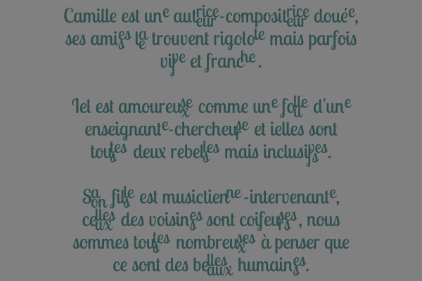
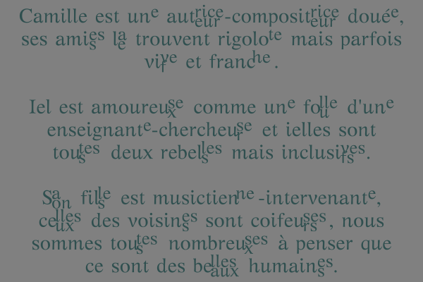

# Post-binary font patcher

A cli tool used to patch a font in order to add post-binary ligatures.

Inspired by the [genderfluid fonts](https://typotheque.genderfluid.space) from the [Bye Bye Binary collective](https://www.byebyebinary.space/).

## Installation

1. [Download FontForge](https://fontforge.org/en-US/downloads/);
2. Clone repository:

```
git clone https://codeberg.org/roipoussiere/post-binary-font-patcher.git
```

Only tested on Linux for now, feedback is welcome for other platforms.

## Usage

This repository contains a script named `pbfp.py` used for command-line interface:

    cd post-binary-font-patcher
    ./pbfp.py help

### Patch a font

    ./pbfp.py <font path>

Example:

    ./pbfp.py /usr/share/fonts/opentype/artemisia/GFSArtemisia.otf

### Preview a font

    ./pbfp.py <font name>

Example:

    ./pbfp.py "GFS Artemisia"

### Configuration

Either modify:
- `post_binary_font_patcher/config.py` to edit configuration;
- `ligatures.json` to change ligature behavior.

## Previews

Lobster:



Chilanka:


GFS Artemisia:



## License

- Post binary font patcher (this project): [MIT](./LICENSE)
- Fonts used in preview images: [OFL](https://openfontlicense.org/)

## Contact

You can either:

- fill an issue on [Codeberg](https://codeberg.org/roipoussiere/post-binary-font-patcher/issues) or Github;
- contact me [on Mastodon](https://mastodon.tetaneutral.net/@roipoussiere).
